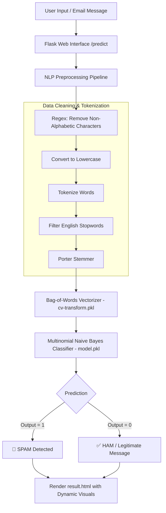

# 🛡️ Email & SMS Spam Detection using Natural Language Processing (NLP)

[](https://www.python.org/)
[](https://flask.palletsprojects.com/)
[](https://scikit-learn.org/)
[](https://www.nltk.org/)
[](LICENSE)
[](https://github.com/AhryRaj/Email_spam_detection_using_NLP/pulls)

An end-to-end Machine Learning web application designed to classify messages and emails as **Spam** or **Ham (Legitimate)** in real time. The solution integrates an Natural Language Processing (NLP) pipeline with a tuned **Multinomial Naive Bayes** classifier and a lightweight, responsive **Flask** web interface featuring animated visual feedback.

---

## 📑 Table of Contents

- [Overview](#-overview)
- [Key Features](#-key-features)
- [System Architecture](#-system-architecture)
- [NLP & Machine Learning Pipeline](#-nlp--machine-learning-pipeline)
- [Project Directory Structure](#-project-directory-structure)
- [Tech Stack](#-tech-stack)
- [Installation & Setup](#-installation--setup)
- [Running the Application](#-running-the-application)
- [Model Retraining](#-model-retraining)
- [Sample Test Cases](#-sample-test-cases)
- [Future Roadmap](#-future-roadmap)
- [Contributing](#-contributing)
- [License](#-license)
- [Author](#-author)

---

## 🔍 Overview

With billions of emails and SMS messages exchanged daily, spam messages pose severe security threats—ranging from phishing scams and malicious links to unwanted advertising. 

This project tackles message classification using classic NLP techniques and statistical machine learning:
1. **Raw Text Processing**: Normalizes text through regex-based symbol removal, lowercasing, stopword elimination, and Porter stemming.
2. **Feature Engineering**: Converts cleaned vocabulary into numeric vectors using Bag-of-Words (`CountVectorizer` with top 3,500 features).
3. **Probabilistic Classification**: Utilizes a Multinomial Naive Bayes classifier optimized with Laplace smoothing (`alpha=0.8`).
4. **Interactive Deployment**: Offers instant predictions through a Flask web application with dynamic animations and clear visual indicators.

---

## ✨ Key Features

- **⚡ Real-Time Predictions**: Instant classification of custom messages entered by the user.
- **🧹 Robust Text Preprocessing**: Automated cleaning pipeline handling noisy, unformatted inputs.
- **📊 Bag of Words (BoW) Representation**: High-dimensional feature vector extraction capturing critical spam-indicative keywords.
- **🎯 Tuned Naive Bayes Classifier**: High precision and recall optimized for text categorization tasks.
- **🎨 Interactive Web Interface**:
  - Gradient animated header and background styling.
  - Intuitive input area with helpful placeholder examples.
  - Visual response screen with conditional status badges and animated GIFs for **Spam** vs. **Ham**.
- **💾 Serialized Model Artifacts**: Pre-trained vectorizer (`cv-transform.pkl`) and model (`model.pkl`) for rapid deployment without retraining overhead.

---

## 🏗️ System Architecture



---

## 🧠 NLP & Machine Learning Pipeline

### 1. Data Ingestion & Preprocessing
The model is trained on a comprehensive collection of labeled messages (`EmailCollection`). Each message undergoes:
- **Character Filtering**: Strips out non-alphabet characters (`re.sub('[^a-zA-Z]', ' ', message)`).
- **Case Normalization**: Converts all text to lowercase.
- **Tokenization**: Splits text strings into individual tokens.
- **Stopword Removal**: Filters out common English words using `nltk.corpus.stopwords`.
- **Stemming**: Reduces inflected/derived words to their word stem using `nltk.stem.PorterStemmer`.

### 2. Feature Extraction
- **Vectorization**: Transforms cleaned text into a sparse numeric matrix using Scikit-Learn's `CountVectorizer(max_features=3500)`.
- **Target Encoding**: Converts binary labels (`ham` = 0, `spam` = 1) via dummy encoding.

### 3. Model Training & Evaluation
- **Data Splitting**: 80% training set and 20% test set (`train_test_split(..., test_size=0.20, random_state=0)`).
- **Algorithm**: `MultinomialNB(alpha=0.8)` which effectively models discrete word counts and handles zero-frequency words through additive smoothing.
- **Persistence**: Serialized using Python's `pickle` library for production inference.

---

## 📂 Project Directory Structure

```plaintext
Email_spam_detection_using_NLP/
├── static/
│   ├── not-spam.gif         # Visual asset displayed for legitimate messages
│   ├── not-spam1.webp       # Alternate legitimate graphic asset
│   ├── spam.gif             # Visual asset displayed for detected spam
│   ├── spam1.webp           # Alternate spam graphic asset
│   ├── spam-favicon.ico     # Browser favicon
│   └── styles.css           # Styling with CSS animations and responsive cards
├── templates/
│   ├── home.html            # Main landing page with message submission form
│   └── result.html          # Prediction results page with dynamic indicators
├── EmailCollection          # Tab-separated dataset of labeled SMS / Email messages
├── app.py                   # Flask server handling routing and prediction requests
├── spam.py                  # Pipeline script: EDA, preprocessing, training & serialization
├── cv-transform.pkl         # Pickled CountVectorizer vocabulary (3,500 features)
├── model.pkl                # Pickled trained Multinomial Naive Bayes classifier
├── requirements.txt         # Project dependencies
└── README.md                # Project documentation
```

---

## 💻 Tech Stack

| Domain | Technologies |
| :--- | :--- |
| **Language** | Python 3.8+ |
| **Machine Learning & NLP** | `scikit-learn`, `nltk`, `pandas`, `numpy` |
| **Data Visualization** | `seaborn`, `matplotlib` |
| **Web Framework** | `Flask`, `Jinja2` |
| **Frontend** | HTML5, CSS3 (Keyframe Animations, Flexbox), FontAwesome, Google Fonts |
| **Model Serialization** | `pickle` |

---

## 🚀 Installation & Setup

Follow these steps to set up and run the project locally:

### 1. Clone the Repository
```bash
git clone https://github.com/AhryRaj/Email_spam_detection_using_NLP.git
cd Email_spam_detection_using_NLP
```

### 2. Create and Activate a Virtual Environment
```bash
# On macOS / Linux:
python3 -m venv venv
source venv/bin/activate

# On Windows:
python -m venv venv
venv\Scripts\activate
```

### 3. Install Dependencies
```bash
pip install -r requirements.txt
```

### 4. Download Required NLTK Corpora
Run a quick Python command to download the tokenizer and stopword dictionaries:
```bash
python3 -c "import nltk; nltk.download('punkt'); nltk.download('stopwords'); nltk.download('wordnet')"
```

---

## 🖥️ Running the Application

Start the Flask development server:
```bash
python app.py
```

Once started, open your browser and navigate to:
```
http://127.0.0.1:5000/
```

1. Enter or paste an email or SMS message into the text area.
2. Click **Predict**.
3. View the classification result along with the corresponding status badge and visual graphic.

---

## 🔄 Model Retraining

If you wish to train the model from scratch, update the dataset, or adjust hyperparameters:

1. Ensure `EmailCollection` is in the project root.
2. Open and edit `spam.py` (e.g., adjust `max_features`, `alpha`, or stemmer/lemmatizer).
3. Uncomment the `pickle.dump` lines:
   ```python
   # Line 48:
   pickle.dump(cv, open('cv-transform.pkl', 'wb'))
   
   # Line 83:
   pickle.dump(mnb, open('model.pkl', 'wb'))
   ```
4. Execute the training script:
   ```bash
   python spam.py
   ```
5. The updated `cv-transform.pkl` and `model.pkl` files will be saved automatically for the web server to use.

---

## 🧪 Sample Test Cases

You can test the system using the following example messages:

| Message Type | Sample Input Text | Expected Result |
| :--- | :--- | :--- |
| **Spam** | `WINNER!! As a valued network customer you have been selected to receive a £900 prize reward! To claim call 09061701461. Claim code KL341. Valid 12 hours only.` | 🚨 **SPAM** |
| **Spam** | `URGENT! You have won a 1 week FREE membership in our £100,000 Prize Jackpot! Txt the word: CLAIM to No: 81010` | 🚨 **SPAM** |
| **Ham (Legitimate)** | `Hey, are we still meeting for lunch at 1 PM today? Let me know!` | ✅ **NOT A SPAM (HAM)** |
| **Ham (Legitimate)** | `I've sent the updated project report to your email. Please review it when you have a moment.` | ✅ **NOT A SPAM (HAM)** |

---

## 🔮 Future Roadmap

- [ ] **TF-IDF Vectorization**: Experiment with n-grams and TF-IDF weighting for better contextual differentiation.
- [ ] **Advanced Architectures**: Benchmark against Support Vector Machines (SVM), Random Forests, and transformer models (e.g., DistilBERT).
- [ ] **REST API Endpoints**: Expose `/api/predict` returning JSON payloads for headless integrations and mobile apps.
- [ ] **Spam Probability Score**: Display prediction confidence percentages on the results page.
- [ ] **Containerization**: Add Dockerfile and docker-compose configurations for seamless cloud deployment (Render, AWS ECS, or Fly.io).

---

## 🤝 Contributing

Contributions are always welcome! If you'd like to improve the model, add features, or enhance UI styling:

1. **Fork** the repository.
2. Create a new branch (`git checkout -b feature/AmazingFeature`).
3. Commit your changes (`git commit -m 'Add some AmazingFeature'`).
4. Push to the branch (`git push origin feature/AmazingFeature`).
5. Open a **Pull Request**.

---

## 📄 License

This project is open-source and distributed under the [MIT License](LICENSE).

---

## 👤 Author

**Ahry Raj**
- GitHub: [@AhryRaj](https://github.com/AhryRaj)
- Project Repository: [Email_spam_detection_using_NLP](https://github.com/AhryRaj/Email_spam_detection_using_NLP)

---

*⭐️ If you found this project helpful, consider starring the repository!*
